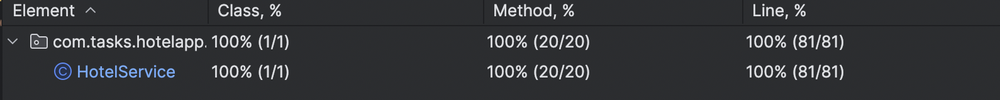

# Hotel-App

## What is it?
Hotel-App is a RESTful web service built using the Spring Framework. It provides an interface for managing hotel properties, searching for hotels, and filtering them by various parameters.

## API Reference

### Get all hotels
```http
GET /property-view/hotels
```
Returns a list of all hotels.

### Get a hotel by ID
```http
GET /property-view/hotels/{id}
```
| Parameter | Type     | Description                |
| :-------- | :------- | :------------------------- |
| `id` | `Long` | **Required**. ID of the hotel |

Returns the details of a specific hotel.

### Search hotels with filters
```http
GET /property-view/search
```
| Query Parameter | Type     | Description                |
| :-------- | :------- | :------------------------- |
| `name` | `string` | Hotel name |
| `brand` | `string` | Brand of the hotel |
| `city` | `string` | City where the hotel is located |
| `country` | `string` | Country where the hotel is located |
| `amenities` | `List<string>` | List of amenities to filter hotels by |

Returns a list of hotels matching the search criteria.

### Create a new hotel
```http
POST /property-view/hotels
```
| Body | Type     | Description                |
| :-------- | :------- | :------------------------- |
| `name` | `string` | **Required**. Name of the hotel |
| `brand` | `string` | **Required**. Brand of the hotel |
| `city` | `string` | **Required**. City where the hotel is located |
| `country` | `string` | **Required**. Country where the hotel is located |
| `amenities` | `List<string>` | List of amenities available in the hotel |

Returns the created hotel object.

### Add amenities to a hotel
```http
POST /property-view/hotels/{id}/amenities
```
| Parameter | Type     | Description                |
| :-------- | :------- | :------------------------- |
| `id` | `Long` | **Required**. ID of the hotel |
| Body | Type     | Description                |
| `amenities` | `List<string>` | **Required**. List of new amenities to add |

Adds new amenities to an existing hotel.

### Get hotel histogram data
```http
GET /property-view/histogram/{param}
```
| Parameter | Type     | Description                |
| :-------- | :------- | :------------------------- |
| `param` | `string` | **Required**. Parameter to generate histogram (e.g., city, country, brand) |

Returns a histogram with counts based on the provided parameter.

## Installation & Running

### Prerequisites
- Java Development Kit (JDK) 17 or later
- Apache Maven 3.9.6

### Clone the repository
```bash
git clone https://github.com/BlackDaddy220232/Hotel-App.git
```

### Navigate into the directory
```bash
cd Hotel-App
```

### Run the application
```bash
mvn spring-boot:run
```

## Database Configuration

The application uses an H2 database by default but can be configured to use any other relational database through JPA.

### Default H2 Database Configuration (application.properties)
```
spring.datasource.url=jdbc:h2:file:/YourPath/HotelApp
spring.datasource.name=1
spring.datasource.password=1
spring.jpa.hibernate.ddl-auto=create-drop
spring.jpa.database-platform=org.hibernate.dialect.H2Dialect
spring.datasource.driverClassName=org.h2.Driver
spring.jpa.defer-datasource-initialization=true
spring.sql.init.mode=never
server.port=8092
```

### Changing Database
To switch to another database (e.g., PostgreSQL or MySQL), update `application.properties` as follows:

#### Example: PostgreSQL
```
spring.datasource.url=jdbc:postgresql://localhost:5432/hotelapp
spring.datasource.username=your-username
spring.datasource.password=your-password
spring.jpa.hibernate.ddl-auto=update
spring.jpa.database-platform=org.hibernate.dialect.PostgreSQLDialect
```

#### Example: MySQL
```
spring.datasource.url=jdbc:mysql://localhost:3306/hotelapp
spring.datasource.username=your-username
spring.datasource.password=your-password
spring.jpa.hibernate.ddl-auto=update
spring.jpa.database-platform=org.hibernate.dialect.MySQL8Dialect
```
### Tests
The service layer of the "Hotel-App" application has **100% unit test coverage**. This means that every method and code path in the service layer is thoroughly tested, ensuring the correctness of the application's core functionality.


## Technologies Used
- **Spring Boot**
- **Spring Web**
- **Spring Data JPA**
- **H2 Database (default, but configurable)**
- **Maven**

## Contributing
Contributions are welcome! Feel free to submit a pull request.

## License
This project is licensed under the MIT License.

## Author
Developed by Black Daddy.

